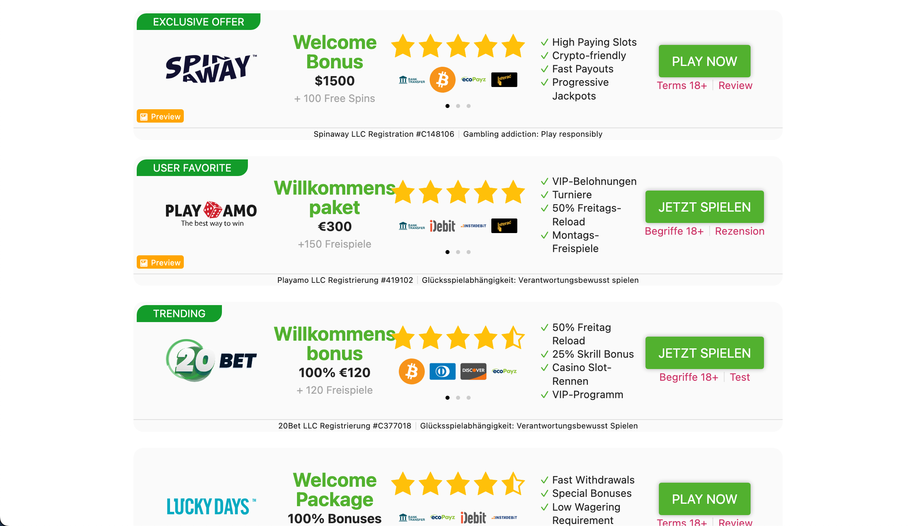
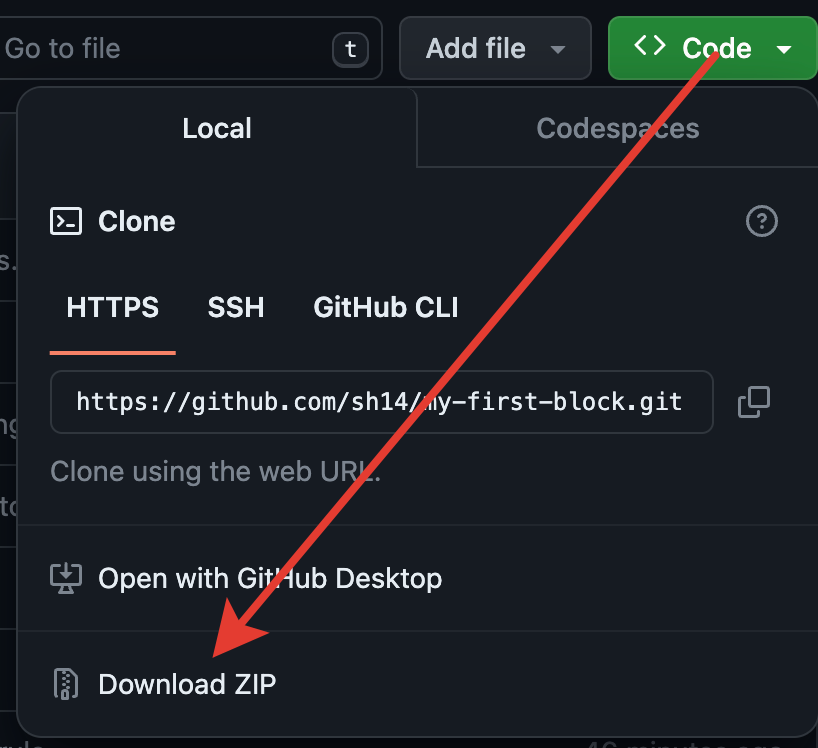
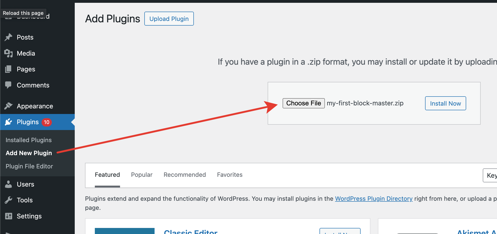
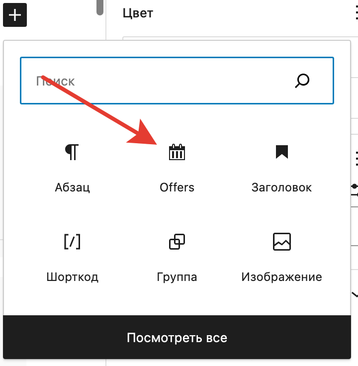
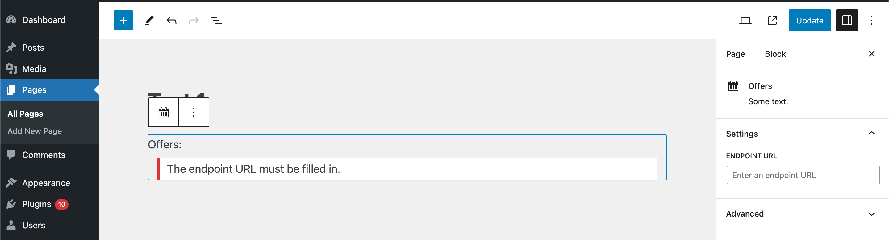
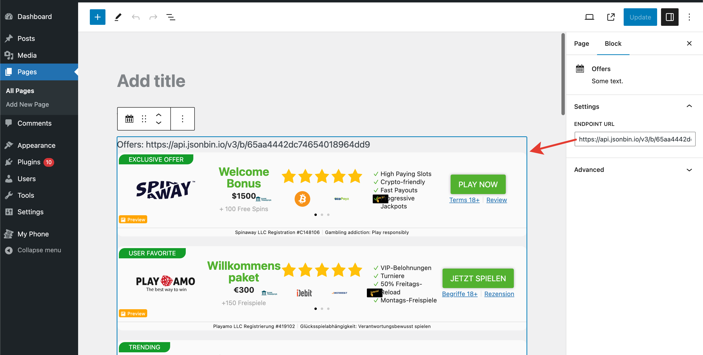

# Offers

A Gutenberg block that provides some offers.

## Objective

Develop a WordPress plugin that allows users to display offers from an external API. The plugin will create a Gutenberg
block, named "Offers Block", which users can add to their posts or pages. The block will have a field for entering the
API URL, and once set, it will display the offers on the frontend.

## Requirements

1. Plugin Setup:
	* The plugin should be a standard WordPress plugin with proper file structure.
	* It should follow WordPress coding standards and best practices.
2. Object-Oriented Programming:
	* The codebase should be structured using Object-Oriented Programming (OOP) principles.
	* Make use of classes and methods appropriately to organize the functionality.
3. Gutenberg Block Creation:
	* Create a custom Gutenberg block using modern JavaScript (ES6+).
	* The block should have a user-editable field for input the API URL.
	* Implement block validaLon to ensure the URL is valid.
4. Advanced Custom Fields (ACF) Integration (Optional):
	* If comfortable, use ACF to create the field for the API URL. This is optional and can be done without
	  ACF as well.
5. SCSS Skills:
	* Style the Gutenberg block and the frontend display using SCSS.
	* Demonstrate the use of SCSS features like variables, nesLng, and mixins.
6. JavaScript Skills:
	* Use JavaScript for dynamic elements of the block.
	* Show proficiency in modern JavaScript features
7. API Consumption:
	* Identify the required data (based on design below) and fetch it from the provided API: <--->
	* For images such as logo, deposit icons please use the dark version.
	* Handle API responses and errors gracefully.
	* Parse and display the offers data on the frontend (based on designs below).
8. Plugin Functionality:
	* Once the API URL is added in the Gutenberg block, the plugin should fetch and display the offers.
	* Ensure the display is visually appealing and user-friendly.
	* Implement a carousel for deposit methods (or use a 3rd party script if preferred)
9. Documentation:
	1. Provide clear documentation on how to install and use the plugin.
	2. Include inline comments in the code for clarity.
10. Bonus (Optiona – Backend Development):
	* Implement caching for API responses to optimize performance.
	* Implement a local caching mechanism for images
	  Submission Guidelines:
	* Submit the complete plugin code, including all source files (zip file or you can use Git).
	* Provide a README file with installation and usage instructions.
	* Include any additional notes or explanations regarding the implementation.
	* The designs don’t need to be pixel perfect

## How to install

* Download the ZIP file;
* Go to WordPress admin panel and install the plugin as usual;
* Activate it;
* Create post or page with Block Editor;
* Find "Offers" block using search and add it to the page;
* Enter a valid endpoint URL to specified field;
* Wait for some time while images are cached;
* Save the post.

## Description

1. After you add a block, it will take some time before it is displayed, so all the images for the block are downloaded.
   Be patient.
2. It’s best to “cache” images using cron, but I didn’t do that in the test task.
3. The appearance of the buttons may not be the same as I intended due to style considerations. Depends on the theme you
   are using. Since the fork is not for mass use, I decided not to fix it.
4. I prepared a data array for use with the template engine, but then decided against installing it so as not to create
   a PHP dependency in the plugin. But the merchant should use a template engine to separate the logic from the
   templates.
5. The appearance of the building greatly depends on the container beds in which they are located. I didn’t waste time
   making it perfect, since the task didn’t require it.
6. The following work on the blocks: Preview and slider buttons, switching occurs by clicking on bullets, I did not set
   up a timer.
7. Storage time of cached data, image types and other parameters in the code, because There was no task to put them in
   the site admin area, but for production this can be done.

**All tasks were completed.**

## Screenshots

1. Frontend view
   
2. Download ZIP
   
3. Install the plugin
   
4. Find block
   
5. Enter endpoint URL
   
6. Admin panel view
   
